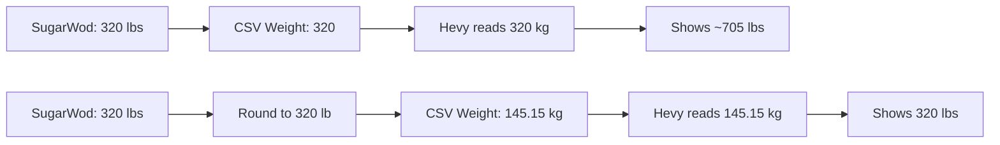
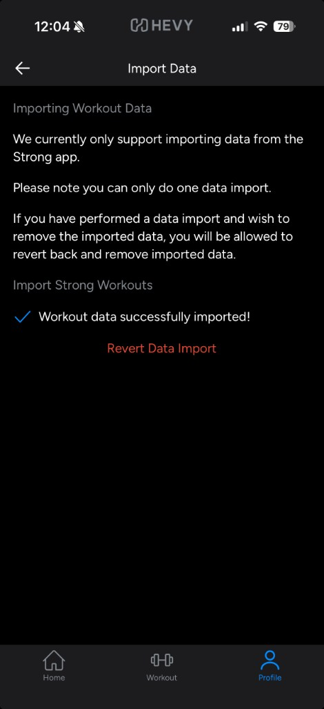

# Migration learnings (SugarWod → Hevy)

Notes from building and validating this converter. Useful if weights look wrong after import or you are debugging Hevy behavior.

- [README.md](../README.md) — overview
- [USAGE.md](USAGE.md) — converter usage and weight units
- [IMPORT_HEVY.md](IMPORT_HEVY.md) — Hevy import and revert
- [STRONG_FORMAT.md](STRONG_FORMAT.md) — Strong CSV output schema
- [SUGARWOD_FORMAT.md](SUGARWOD_FORMAT.md) — SugarWod input CSV schema

## Converter behavior (not bugs)

These are intentional choices when mapping SugarWod → Strong. Full input schema: [SUGARWOD_FORMAT.md](SUGARWOD_FORMAT.md).

### Date becomes noon

SugarWod only exports `MM/DD/YYYY` with no session time. The converter writes `YYYY-MM-DD 12:00:00` in the Strong CSV. Native Strong exports use real clock times — do not expect time-of-day accuracy in Hevy after import.

### Lift duration is estimated

For `Load` workouts, `Duration` is **not** from SugarWod. The script estimates `max(15, min(120, num_sets × 4))` minutes (e.g. 5 sets → `20m`). Timed WODs use actual elapsed time from `set_details` or `best_result_raw`.

### Single logged weight replicated across sets

When SugarWod has **one** `load` in `set_details` but the description prescribes multiple rep sets (e.g. `Shoulder Press 5x6` with only the top set weighted), the converter **replicates that load** on every set row. This matches common SugarWod logging where athletes only record the heaviest working weight.

### Mismatched load/rep counts

When loads and reps are both present but counts differ, the converter pairs by walking reps and carrying forward the last known load when a set index has no new load. See `build_load_sets()` in `convert_sugarwod_to_hevy.py`.

### Rounds + Reps WODs lose structured score

`score_type = Rounds + Reps` (e.g. Cindy `16+1`) is handled as a **generic WOD row**: `Weight=0`, `Reps=0`, `Seconds=0`. The rounds+reps result appears in `Notes` via `best_result_display`, but is **not** written to the Strong `Reps` column. Improving this would require mapping `set_details.rnds` / `set_details.reps` explicitly.

### Output differs from native Strong exports

| Field | Native Strong | This converter |
|-------|---------------|----------------|
| `Date` time | Real session time | Always `12:00:00` |
| `Weight` format | Often `40.0` (1 decimal) | Adaptive kg, 2–3 decimals in practice / caps at 5 (`lbs_to_strong_kg`) |
| `Duration` (lifts) | Actual elapsed | Estimated from set count |
| `RPE` | Sometimes populated | Always empty |

## Hevy treats Strong CSV weights as kilograms

The Strong export schema has a single `Weight` column with **no unit field**. Hevy's **Import Strong CSV** follows Strong's convention: values are stored internally as **kg**, then converted to your display preference (e.g. lbs).

SugarWod exports barbell loads in **pounds**. If you copy those numbers straight into the CSV, Hevy still reads them as kg.



| CSV `Weight` | Hevy interprets as | Display in lbs |
|--------------|-------------------|----------------|
| `320` (raw SugarWod lbs) | 320 kg | **~705 lbs** (320 × 2.205) |
| `145.15` (converted) | 145.15 kg | **320 lbs** |

**You cannot tell Hevy "these numbers are lbs."** The workaround is to write kg values that round-trip to your original plate weights when Hevy converts back to lbs.

## Why convert at all if SugarWod is in lbs?

Your data is correct in SugarWod. The conversion happens **only when writing the Strong CSV**, because Hevy's importer has a fixed kg assumption. This is not a SugarWod unit problem.

## Rounding: whole pounds + adaptive kg precision

Two separate precision issues showed up in practice:

### 1. Inflated weights (~2.2×)

Writing `320.0` in the CSV → Hevy shows ~705 lbs. Fixed by lbs → kg conversion (see above).

### 2. Off-by-a-fraction display (319.89 vs 320, 189.99 vs 190)

After the kg fix, weights could still display slightly under the true load in Hevy:

| Problem | Cause |
|---------|--------|
| 320 → **319.89** lbs | `145.1` kg (1 decimal) loses precision on round-trip |
| 190 → **189.99** lbs | `86.18` kg (2 decimals) still round-trips to 189.994… lbs |

Example for 190 lbs:

```
190 × 0.45359237 = 86.18255… kg
86.18 kg ÷ 0.45359237 = 189.994… lbs  →  Hevy displays "189.99"
86.183 kg ÷ 0.45359237 = 190.001… lbs →  Hevy displays "190.00"
```

### How `lbs_to_strong_kg()` fixes it

The script cannot write `190` in the CSV (Hevy would read 190 **kg**). It must find a kg string whose round-trip matches the target lb display:

1. Round the SugarWod load to the **nearest whole pound** (`190`)
2. Compute exact kg: `lbs × LBS_TO_KG`
3. Try formatting at **2, 3, 4, then 5** decimal places
4. For each candidate, simulate Hevy: `formatted_kg → lbs → round to 2 decimals for display`
5. Return the **shortest** string where that display equals the target whole lb (`190.00`)

```python
def lbs_to_strong_kg(lbs: float) -> str:
    lbs = round(lbs)
    kg = lbs * LBS_TO_KG
    for precision in range(2, 6):
        formatted = f"{kg:.{precision}f}"
        if round(float(formatted) / LBS_TO_KG, 2) == lbs:
            return formatted
    return f"{kg:.4f}"  # fallback (not needed for typical gym loads)
```

Some weights need 2 decimals, others need 3 — it depends on where floating-point rounding lands. The algorithm picks the right precision per weight automatically.

### Verified: common gym loads are not "just off"

Every **whole pound from 45–500** was tested against this round-trip check. **Zero failures.** Nothing in that range needed more than 3 decimal places in kg.

| lbs | CSV kg | Decimals | Hevy display |
|-----|--------|----------|--------------|
| 100 | 45.36 | 2 | 100.00 |
| 135 | 61.235 | 3 | 135.00 |
| 185 | 83.915 | 3 | 185.00 |
| 190 | 86.183 | 3 | 190.00 |
| 200 | 90.72 | 2 | 200.00 |
| 225 | 102.06 | 2 | 225.00 |
| 275 | 124.74 | 2 | 275.00 |
| 300 | 136.078 | 3 | 300.00 |
| 315 | 142.88 | 2 | 315.00 |
| 320 | 145.15 | 2 | 320.00 |
| 335 | 151.953 | 3 | 335.00 |
| 350 | 158.757 | 3 | 350.00 |
| 400 | 181.437 | 3 | 400.00 |
| 405 | 183.705 | 3 | 405.00 |
| 500 | 226.796 | 3 | 500.00 |

Round hundreds (100, 200, 300) are fine. The 190 lb case was the surprise — it needed 3 decimals while neighbors like 200 only need 2.

### Caveat: fractional SugarWod loads

The script rounds to the nearest whole pound before converting. That matches typical barbell logging (2.5 lb plate increments, usually recorded as whole numbers). If SugarWod had `187.5` lbs, it would become `188` in the CSV.

## SugarWod export duplicate rows

SugarWod exports can contain **multiple CSV rows for the same workout** — same `date` and `title`, with different `set_details`. This is normal in the export, not a sign you lost data upstream.

The converter deduplicates on `(date, title)` and **keeps the row with the richest `set_details`** (most logged sets). When duplicates are dropped, the script prints:

```text
Deduplicated N duplicate workout rows (840 -> 826 unique workouts)
```

If your input count is higher than "unique workouts converted," that is expected. The kept row is always the one with the most set data.

## Unmapped exercise names become custom exercises in Hevy

SugarWod lift names are mapped to Hevy/Strong canonical names via `EXERCISE_NAME_MAP` in `convert_sugarwod_to_hevy.py` (e.g. `Back Squat` → `Squat (Barbell)`).

Names **not** in the map pass through unchanged. Hevy imports them as **custom exercises**, which can clutter your library and split history across duplicates (e.g. `Back Squat` vs `Squat (Barbell)` for the same movement).

**Symptom:** the same lift appears twice in Hevy with slightly different names.

**Fix:** add the SugarWod name to `EXERCISE_NAME_MAP`, regenerate `output/workouts_hevy.csv`, revert the Hevy import, and re-import.

## What is not a converter bug

### "1 rep" on a set that was 5 reps

Hevy may show a PR or estimated-1RM label on the heaviest set (e.g. "Back Squat 1×5"). The CSV can have the correct rep count (`5`); this is Hevy UI, not bad reps in the export.

### Same-day workouts merged in Hevy

Multiple SugarWod entries on one calendar day may appear as one workout in Hevy. That is Hevy import behavior, not a weight or schema issue.

### Hevy allows only one Strong CSV import

To re-import after fixing weights:

1. Hevy → Profile → Settings → Export & Import Data → **revert/remove** the previous import
2. Regenerate `output/workouts_hevy.csv`
3. Import Strong CSV again
4. Spot-check a known session (e.g. squat 320×5, not ~705 or 319.89)

### Revert without leaving the Import Data screen

Right after import, Hevy shows **Workout data successfully imported!** with a red **Revert Data Import** link. You can tap between **Home** and **Profile** on the bottom nav and the revert option **stays available** as long as you do not fully exit the import flow. Use this window to spot-check workouts in Hevy and undo if weights or exercises look wrong.



If you miss that window, revert from **Profile** → **Settings** → **Export & Import Data** instead.

## Validation spot checks

### Hevy-verified sessions

These were confirmed correct **in the Hevy app** after import (not just in the CSV):

| Date | Session | Why it's a good check |
|------|---------|------------------------|
| 2026-06-09 | Back Squat 1×5 @ 320, 3×12 @ 190, RDL 5×5 @ 225 | Mix of 2dp and 3dp kg in one day; 190 lb was the weight that originally showed 189.99 |
| 2023-01-18 | Bench Press pyramid `5-4-3-2-1-1-1-1-1` | **Best rounding stress test** — one exercise ramps through 155→195 lbs with 2, 3, and 4 decimal kg values in the same workout |
| 2023-01-09 | Deadlift 5×3 (PR) | Two tricky 3dp weights in one lift: 335 lb (`151.953`) sets 1–3, 355 lb (`161.025`) sets 4–5 |

**Jan 18 bench pyramid** (verified in Hevy):

| Reps | SugarWod lbs | CSV kg | Decimals |
|------|--------------|--------|----------|
| 5 | 155 | 70.307 | 3 |
| 4 | 165 | 74.843 | 3 |
| 3 | 175 | 79.38 | 3 |
| 2 | 185 | 83.915 | 2 |
| 1 | 190 | 86.183 | 3 |
| 1 | 195 | 88.45 | 2 |

Neighboring sets can use different kg precisions — that is expected and correct.

**Optional extra checks** (CSV-validated, not re-confirmed in Hevy this session):

| Date | Session | Notes |
|------|---------|-------|
| 2022-10-17 | Push Press 135 / 145 | Both need 3dp (`61.235`, `65.77`) |
| 2022-10-18 | Back Squat 1×1 @ 350 | `158.757` kg (3dp) |

### CSV spot checks

After conversion, grep or open `output/workouts_hevy.csv` and confirm:

| Date | Exercise | SugarWod lbs | Expected CSV kg |
|------|----------|--------------|-----------------|
| 2026-06-09 | Back Squat 1×5 | 320 | 145.15 |
| 2026-06-09 | Back Squat 3×12 | 190 | 86.183 |
| 2026-06-09 | RDL 5×5 | 225 | 102.06 |
| 2022-10-18 | Back Squat 1×1 | 350 | 158.757 |
| 2021-12-14 | Back Squat 1×1 | 335 | 151.953 |

WOD/cardio rows should still have `Weight=0` (e.g. Murph: `Seconds=2762`, `Weight=0`).

## CLI escape hatches

| Flag | Effect |
|------|--------|
| `--input-weight-unit lbs` (default) | SugarWod loads are pounds |
| `--strong-weight-unit kg` (default) | Write kg for Hevy |
| `--strong-weight-unit lbs` | Write whole lbs to CSV — **will inflate ~2.2× in Hevy** (legacy/debug only) |

## Constants

```python
LBS_TO_KG = 0.45359237
```

Hevy appears to use the standard kg ↔ lbs conversion when displaying in pounds. The script rounds lbs first, then picks the shortest kg precision (tries 2 → 5 decimals; 2–3 suffice for every whole pound 1–1000) where the round-trip displays as the target whole lb in `lbs_to_strong_kg()`.
