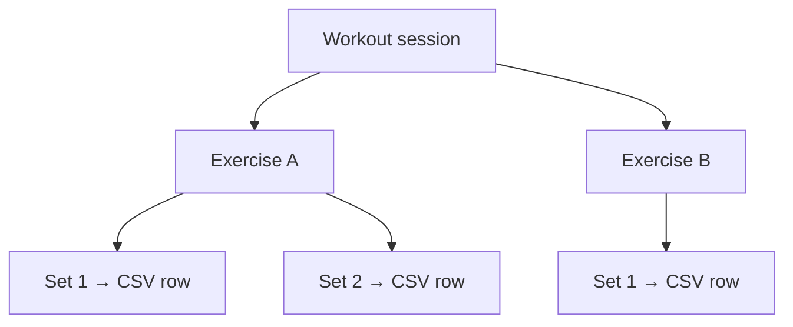

# Strong app CSV format reference

This document describes the **Strong app workout export CSV schema** — the format Hevy accepts via **Import Strong CSV**. It is written for humans and for AI agents that need to generate, validate, or transform Strong-compatible files without reading the converter source first.

**Official source:** Strong exports this format from in-app Settings → **Export Strong Data** (iOS) or **Export Data** (Android). See [Strong Help: export workout data](https://help.strongapp.io/article/235-export-workout-data). Strong does **not** support re-importing its own CSV; Hevy and other apps consume it as an interchange format.

**Related docs in this repo:**

- [README.md](../README.md) — overview and pick-your-path
- [USAGE.md](USAGE.md) — how to run the converter
- [IMPORT_HEVY.md](IMPORT_HEVY.md) — Hevy import and revert
- [SUGARWOD_FORMAT.md](SUGARWOD_FORMAT.md) — SugarWod input CSV schema
- [LEARNINGS.md](LEARNINGS.md) — Hevy weight-unit behavior, rounding, re-import limits

---

## File shape

| Property | Value |
|----------|-------|
| Encoding | UTF-8 |
| Delimiter | Comma (`,`) — not semicolon |
| Row model | **One row per set** (not one row per workout) |
| Header row | Required; English column names exactly as below |
| Quoting | RFC 4180 minimal quoting; fields with commas or quotes are double-quoted |



Within a workout, **repeated column values** (`Date`, `Workout Name`, `Duration`, `Workout Notes`) are identical on every set row. **`Set Order` resets to `1`** at the start of each exercise.

---

## Column schema (12 columns, fixed order)

Header line (copy exactly — Hevy is strict):

```text
Date,Workout Name,Duration,Exercise Name,Set Order,Weight,Reps,Distance,Seconds,Notes,Workout Notes,RPE
```

| # | Column | Type | Scope | Description |
|---|--------|------|-------|-------------|
| 1 | `Date` | datetime | Workout | When the session started. Format: `YYYY-MM-DD HH:MM:SS` (24-hour clock). Native Strong exports use real session times; this converter uses `12:00:00` because SugarWod only provides the calendar date. |
| 2 | `Workout Name` | string | Workout | User-visible session title (e.g. `Evening Workout`, `Back Squat 5x3`). |
| 3 | `Duration` | string | Workout | **Elapsed** session length, not a clock time. Strong uses human-readable tokens: `45m`, `2h 38m`, `3h`, `1h`. Minimum practical value in exports is often `1m`. This is **not** per-set rest (Strong does not export rest). |
| 4 | `Exercise Name` | string | Exercise | Canonical Strong/Hevy name when possible: `Squat (Barbell)`, `Bench Press (Barbell)`. Custom names are allowed (WODs, cardio). Equipment is usually in parentheses. |
| 5 | `Set Order` | integer | Set | 1-based index within the exercise. Contiguous `1..N` per exercise. |
| 6 | `Weight` | number | Set | Load for weighted sets. **No unit column** — see [Weight units](#weight-units-critical-for-hevy) below. Use `0` for bodyweight, cardio, and timed work. |
| 7 | `Reps` | integer | Set | Rep count. Use `0` when not applicable (timed WODs, distance-only rows). |
| 8 | `Distance` | number | Set | Distance in the user's Strong distance unit (often km or miles). Use `0` when not used. Example from a real Strong export: swimming `1.0` with `Seconds=30`. |
| 9 | `Seconds` | integer | Set | **Set duration** in seconds (planks, timed intervals, for-time WOD result). Not rest between sets. Use `0` when not used. |
| 10 | `Notes` | string | Set / exercise | Per-set or per-exercise notes. Often empty on strength sets; WOD description and result may live here. |
| 11 | `Workout Notes` | string | Workout | Session-level notes (RX/SCALED, PR flags, athlete comments). Repeated on every row of the workout. |
| 12 | `RPE` | string | Set | Rate of perceived exertion. Often empty in exports; Hevy accepts the column but may ignore values. |

### What Strong does **not** export

These exist in the apps but are **absent from the CSV**:

- Weight unit (kg vs lbs)
- Warmup vs working set flag
- Superset grouping
- Rest duration between sets

Importers must infer or default these.

---

## Formatting rules by column

### `Date`

```
YYYY-MM-DD HH:MM:SS
```

Examples: `2020-12-30 18:51:52`, `2021-12-14 12:00:00`

### `Duration`

Elapsed time tokens (not `HH:MM:SS`):

| Pattern | Example |
|---------|---------|
| Minutes only | `45m`, `5m`, `1m` |
| Hours only | `3h` |
| Hours + minutes | `2h 38m`, `1h 8m` |

### `Weight`

- Numeric string; no unit suffix.
- Native Strong exports often use one decimal (`40.0`, `95.0`) regardless of whether the user lifts in kg or lbs.
- Use `0` for non-weighted work.
- **Hevy import:** treats values as **kilograms** internally — see below.

### `Reps`, `Distance`, `Seconds`

- Integers (or numeric strings) as plain numbers.
- Default unused fields to `0`, not empty, matching Strong export style.

### `Notes` and `Workout Notes`

- May contain commas, bullets, and pipe-separated segments; CSV quoting applies.
- Empty fields are fine (`""` or unquoted empty between commas).

### `RPE`

- Usually blank. When present in some tools, values are typically 1–10.

---

## Row patterns (examples)

### Strength — multiple sets, same exercise

Each set is its own row. `Set Order` increments; `Weight`/`Reps` vary per set.

```csv
Date,Workout Name,Duration,Exercise Name,Set Order,Weight,Reps,Distance,Seconds,Notes,Workout Notes,RPE
2020-12-30 18:51:52,Evening Workout,2h 38m,Snatch (Barbell),1,40.0,3,0,0,,,
2020-12-30 18:51:52,Evening Workout,2h 38m,Snatch (Barbell),2,50.0,2,0,0,,,
2020-12-30 18:51:52,Evening Workout,2h 38m,Snatch (Barbell),3,60.0,1,0,0,,,
```

### Strength — from SugarWod (kg for Hevy)

This repo converts SugarWod pound loads to kg using **adaptive precision** (2–3 decimal places in practice; the algorithm tries up to 5) so Hevy's kg→lbs display matches the original whole-pound load. See [LEARNINGS.md](LEARNINGS.md#rounding-whole-pounds--adaptive-kg-precision).

```csv
2021-12-14 12:00:00,Back Squat 1x1,15m,Squat (Barbell),1,151.953,1,0,0,,RX,
```

(`151.953` kg → 335 lbs in Hevy when display unit is lbs.)

### Timed WOD / cardio — `Seconds` populated

```csv
2022-05-30 12:00:00,MURPH,46m,MURPH,1,0,0,0,2762,"Partition the pull-ups... | result: 46:02 | SCALED","No weight vest... | SCALED | PR",
2022-01-21 12:00:00,Row 500m,1m,Row 500m,1,0,0,0,97,Row 500m | result: 1:37 | RX,RX | PR,
```

### Rep-scored WOD — `Reps` populated

```csv
2022-08-29 12:00:00,Handstand Push-Ups: 2 min max reps,45m,Handstand Push-Ups: 2 min max reps,1,0,16,0,0,Handstand Push-Ups... | result: 16 | RX,Kipping... | RX | PR,
```

### Distance + time (native Strong swimming)

```csv
2021-05-13 12:00:00,Evening Workout,5m,Swimming,1,0,0,1.0,30,,,
```

---

## Weight units (critical for Hevy)

The schema has **one `Weight` column and no unit field.**

| Consumer | Assumption |
|----------|------------|
| Strong app export | Values reflect whatever unit the user chose in Strong settings (kg or lbs). The CSV does not record which. |
| **Hevy Import Strong CSV** | Treats `Weight` as **kilograms**, then converts to the user's display preference (e.g. lbs). |

If you write pound values into the CSV and import to Hevy, loads appear **~2.2× too heavy** (Hevy reads `320` as 320 kg, not 320 lbs).

**This converter's default:** SugarWod loads are lbs → round to whole lb → convert to kg with adaptive precision (2–3 decimals in practice; up to 5) for clean round-trip display in Hevy. Details and spot-check table: [LEARNINGS.md](LEARNINGS.md).

```python
LBS_TO_KG = 0.45359237
# Example: 320 lbs → "145.15" in CSV → 320 lbs in Hevy
# Example: 335 lbs → "151.953" in CSV (3 decimals) → 335 lbs in Hevy
```

---

## Validation checklist

Use this when reviewing any Strong-compatible CSV before Hevy import:

| Check | Pass criteria |
|-------|----------------|
| Header | Exactly 12 columns, English names, correct order |
| Delimiter | Comma-separated |
| Row model | One row per set |
| `Set Order` | Restarts at `1` for each new `Exercise Name` within a workout |
| `Date` + `Workout Name` | Same values on all rows belonging to one session |
| Unused metrics | `0` for unused `Weight` / `Reps` / `Distance` / `Seconds` |
| Timed work | `Seconds` > 0, `Weight` = 0, `Reps` = 0 |
| Strength work | `Weight` > 0 and/or `Reps` > 0; `Seconds` = 0 |
| Hevy weights | If source data is in lbs, `Weight` must be converted to kg |

---

## How this repo maps SugarWod → Strong

Full input schema and `set_details` JSON: [SUGARWOD_FORMAT.md](SUGARWOD_FORMAT.md). Converter quirks (estimated duration, noon dates, etc.): [LEARNINGS.md](LEARNINGS.md#converter-behavior-not-bugs).

| SugarWod signal | Strong output |
|-----------------|---------------|
| `score_type = Load` | One row per set; `Weight` + `Reps` from `set_details` and description |
| Timed WOD (`score_type` empty, time result) | One row; `Seconds` = time; details in `Notes` |
| Rep WOD (`score_type = Reps`) | One row per rep entry or single row with total reps |
| `Rounds + Reps` | Generic WOD row; score in `Notes` only |
| Exercise names | Mapped via `EXERCISE_NAME_MAP` in `convert_sugarwod_to_hevy.py` when possible |
| `Duration` | Estimated `~4 min/set` for lifts; actual elapsed for timed WODs |
| `Workout Notes` | SugarWod notes, RX/SCALED, PR |

Canonical header constant in code:

```python
STRONG_HEADERS = [
    "Date", "Workout Name", "Duration", "Exercise Name", "Set Order",
    "Weight", "Reps", "Distance", "Seconds", "Notes", "Workout Notes", "RPE",
]
```

---

## External references

- [Strong Help: export workout data](https://help.strongapp.io/article/235-export-workout-data)
- [Example native Strong export (GitHub)](https://github.com/AlexandrosKyriakakis/StrongAppAnalytics/blob/main/Data/strong.csv) — real `40.0` kg-style weights, `2h 38m` durations, quoted workout names
- [swift-workout-importer schema notes](https://github.com/gossamr/swift-workout-importer) — per-app CSV semantics including Strong row-per-set model and missing fields

---

## Hevy import constraints

- Use **Import Strong CSV** in Hevy (Settings → Export & Import Data), not a generic file upload.
- **One Strong CSV import per Hevy account** — revert the previous import before re-importing.
- Column headers must remain in **English** exactly as listed above.
