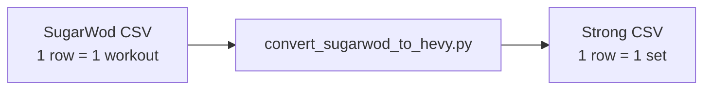

# SugarWod export CSV format reference

This document describes the **SugarWod workout export CSV** (`workouts.csv`) — the input format for `convert_sugarwod_to_hevy.py`. It is written for humans and for AI agents extending or debugging the converter without spelunking the source first.

**How to obtain:** See [EXPORT_SUGARWOD.md](EXPORT_SUGARWOD.md).

**Related docs in this repo:**

- [README.md](../README.md) — overview and pick-your-path
- [USAGE.md](USAGE.md) — how to run the converter
- [EXPORT_SUGARWOD.md](EXPORT_SUGARWOD.md) — export from SugarWOD app
- [STRONG_FORMAT.md](STRONG_FORMAT.md) — output schema (Strong app CSV for Hevy)
- [LEARNINGS.md](LEARNINGS.md) — migration pitfalls, weight rounding, converter quirks

---

## File shape

| Property | Value |
|----------|-------|
| Encoding | UTF-8 |
| Delimiter | Comma (`,`) |
| Row model | **One row per logged workout** (not one row per set) |
| Header row | Required; lowercase column names exactly as below |



A single SugarWod row expands to **one or many** Strong-format set rows depending on `score_type` and `set_details`.

---

## Column schema (11 columns, fixed order)

Header line (from a real export):

```text
date,title,description,best_result_raw,best_result_display,score_type,barbell_lift,set_details,notes,rx_or_scaled,pr
```

| # | Column | Type | Description |
|---|--------|------|-------------|
| 1 | `date` | date | Calendar date only. Format: `MM/DD/YYYY` (US). No time-of-day. |
| 2 | `title` | string | Workout name (e.g. `Back Squat 5x3`, `MURPH`, `Cindy`). |
| 3 | `description` | string | Prescription text. For barbell lifts, includes per-set rep targets like `#1: 3 reps #2: 3 reps`. |
| 4 | `best_result_raw` | number/string | Machine-readable result. Load in **pounds** for `Load`; total **seconds** for timed WODs; rep count for rep WODs. |
| 5 | `best_result_display` | string | Human-readable result (e.g. `335`, `46:02`, `16+1`). |
| 6 | `score_type` | string | How the workout is scored — drives converter routing. See [score_type values](#score_type-values). |
| 7 | `barbell_lift` | string | Canonical lift name for `Load` workouts (e.g. `Back Squat`). Empty for WODs. |
| 8 | `set_details` | JSON string | Array of per-set objects. Structure varies by workout type — see [set_details JSON](#set_details-json). |
| 9 | `notes` | string | Athlete notes for the session. |
| 10 | `rx_or_scaled` | string | `RX`, `SCALED`, or empty. |
| 11 | `pr` | string | `PR` when a personal record, otherwise empty. |

### What SugarWod does **not** export

- Session start time (only date)
- Explicit weight unit (US CrossFit logs are effectively **pounds** for barbell loads)
- Rest between sets
- Per-set RPE

---

## `score_type` values

Observed in real exports (840 rows):

| `score_type` | Count (example export) | Converter behavior |
|--------------|------------------------|------------------|
| `Load` | ~97% | Barbell/strength — one Strong row per set; `Weight` + `Reps` |
| *(empty)* | timed WODs | `Seconds` from `set_details` or `best_result_raw`; WOD text in `Notes` |
| `Reps` | rep-max / AMRAP reps | One Strong row per `set_details` rep entry (or fallback to display) |
| `Rounds + Reps` | AMRAP rounds+reps | **Generic WOD row** — result only in `Notes`, not in `Reps` (see [LEARNINGS.md](LEARNINGS.md#rounds--reps-wods-lose-structured-score)) |
| `Other / Text` | rare | Generic WOD row with notes only |

Routing in code: `score_type == "Load"` → `convert_load_row()`; everything else → `convert_wod_row()`.

---

## `set_details` JSON

A JSON **array** of objects, stored as a string in the CSV cell. Invalid or empty JSON is treated as `[]`.

### Load workouts (`score_type = Load`)

Each object may include:

```json
{"success": true, "load": 335}
```

- `load` — weight in **pounds** (float/int)
- `success` — whether the set was marked successful (ignored by converter)

**Example** — single top set logged for a 5×3:

```json
[{"success": true, "load": 275}]
```

**Example** — per-set loads:

```json
[
  {"success": true, "load": 255},
  {"success": true, "load": 255},
  {"success": true, "load": 275},
  {"success": true, "load": 275},
  {"success": true, "load": 275}
]
```

### Timed workouts (`score_type` empty)

```json
{"mins": 46, "secs": 2}
```

- `mins` / `secs` — components of finish time
- Fallback: `best_result_raw` as total seconds (e.g. `2762` for Murph)

**Example** — Row 500m:

```json
[{"secs": 37, "mins": 1}]
```

(`best_result_raw: 97` = 1×60 + 37)

### Rep workouts (`score_type = Reps`)

```json
{"reps": 16}
```

### Rounds + reps (`score_type = Rounds + Reps`)

```json
{"rnds": 16, "reps": 1}
```

Represents `16+1` rounds. The converter does **not** currently map `rnds`/`reps` to Strong columns — see learnings doc.

---

## Rep parsing from `description`

For `Load` workouts, per-set rep counts are **not** in `set_details`. They are parsed from `description` with this pattern:

```text
#1:  3 reps #2:  3 reps #3:  3 reps
```

Regex: `#\d+:\s*(\d+)\s*reps?` (case-insensitive)

**Example:**

| Field | Value |
|-------|-------|
| `description` | `Back Pause Squat for load: #1: 3 reps #2: 3 reps #3: 3 reps #4: 3 reps #5: 3 reps` |
| Parsed reps | `[3, 3, 3, 3, 3]` |

---

## Pairing loads and reps (`build_load_sets`)

When both loads and reps are present, the converter pairs them:

| Situation | Behavior |
|-----------|----------|
| Same count of loads and reps | Zip 1:1 |
| **One load, many reps** | Replicate the single load across all rep sets (common when only top weight was logged) |
| Many loads, many reps, unequal counts | Walk reps; use load at index `i` when available, else **carry forward** the last load |
| Loads only | One row per load, reps empty → `0` |
| Reps only | One row per rep, weight empty → `0` |
| Neither | Single row with `Weight=0`, `Reps=0` |

---

## Example rows by workout type

### Barbell lift — single logged weight

```csv
12/14/2021,Back Squat 1x1,Back Squat for load: #1:  1 rep ,335,335,Load,Back Squat,"[{""success"":true,""load"":335}]",,RX,
```

→ Strong: 1 set row, `Squat (Barbell)`, weight converted lbs→kg, `Reps=1`.

### Barbell lift — per-set loads

```csv
09/20/2022,Back Pause Squat 5x3,Back Pause Squat for load: #1:  3 reps #2:  3 reps #3:  3 reps #4:  3 reps #5:  3 reps,275,275,Load,Back Pause Squat,"[{""success"":true,""load"":255},{""success"":true,""load"":255},{""success"":true,""load"":275},{""success"":true,""load"":275},{""success"":true,""load"":275}]",2 second pause,RX,
```

→ Strong: 5 set rows with varying kg weights.

### Timed WOD

```csv
05/30/2022,MURPH,Partition the pull-ups...,2762,46:02,,,"[{""secs"":2,""mins"":46}]",No weight vest...,SCALED,PR
```

→ Strong: 1 row, `Seconds=2762`, `Duration=46m`, description + result in `Notes`.

### Rep WOD

```csv
08/29/2022,Handstand Push-Ups: 2 min max reps,Handstand Push-Ups: 2 min max reps,16,16,Reps,,"[{""reps"":16}]","Kipping, a set of 12 then set of 4",RX,PR
```

→ Strong: 1 row, `Reps=16`, WOD details in `Notes`.

### Rounds + reps WOD

```csv
04/07/2022,Cindy,AMRAP 20 minutes of:• 5 pull-ups• 10 push-ups• 15 squats,16.001,16+1,Rounds + Reps,,"[{""rnds"":16,""reps"":1}]",,RX,PR
```

→ Strong: 1 row, `Reps=0`, `Seconds=0`; `16+1` appears in `Notes` only.

---

## Duplicate rows

SugarWod exports may contain **multiple rows with the same `date` + `title`**. The converter deduplicates before conversion:

- Key: `(date, title)`
- Keeps the row whose `set_details` parses to the **longest array**
- Prints `Deduplicated N duplicate workout rows (...)` when any are dropped

This is normal export behavior, not data loss upstream.

---

## Weight units

Barbell `load` values in `set_details` and `best_result_raw` for `Load` workouts are **pounds** for typical US CrossFit logs. The converter accepts `--input-weight-unit` (default `lbs`) and writes Strong CSV kg for Hevy — see [LEARNINGS.md](LEARNINGS.md).

---

## Mapping to Strong CSV (summary)

Full output schema: [STRONG_FORMAT.md](STRONG_FORMAT.md).

| SugarWod field | Strong column(s) |
|----------------|------------------|
| `date` | `Date` → `YYYY-MM-DD 12:00:00` (noon; SugarWod has no time) |
| `title` | `Workout Name`; WOD `Exercise Name` |
| `barbell_lift` / `title` | `Exercise Name` (via `EXERCISE_NAME_MAP` for loads) |
| `set_details.load` | `Weight` (lbs → kg) |
| `description` reps | `Reps` |
| `set_details` time | `Seconds`, `Duration` |
| `set_details.reps` | `Reps` (rep WODs) |
| `notes`, `rx_or_scaled`, `pr` | `Workout Notes` (pipe-separated) |
| `description`, `best_result_display`, `rx_or_scaled` | `Notes` (WODs) |
| *(estimated)* | `Duration` for lifts: `max(15, min(120, sets × 4))` minutes |

---

## Validation checklist

| Check | Pass criteria |
|-------|----------------|
| Header | 11 lowercase columns in order |
| `date` | Parses as `MM/DD/YYYY` |
| `set_details` | Valid JSON array when non-empty |
| `Load` rows | `barbell_lift` or `title` present; `load` in JSON or reps in description |
| Timed rows | `set_details` with `mins`/`secs` or numeric `best_result_raw` |
| Duplicates | Expect some `(date, title)` dupes; converter handles them |
